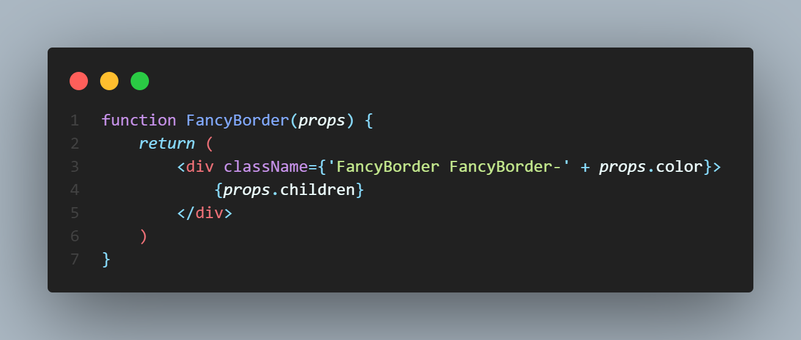
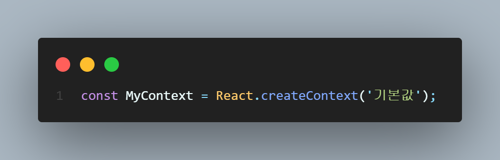

# My-First-React

<br>

### React는 무엇인가?

- A JavaScript library for building user interfaces

<br>

### 사용자 인터페이스 (User Interface, UI)

- 사용자와 컴퓨터 프로그램이 서로 상호작용하기 위해 중간에서 서로간의 입력과 출력을 제어해주는 것

<br>

### 프레임워크(Veu) vs 라이브러리(React)

- 가장 큰 차이점은 프로그램의 흐름에 대한 제어 권한.
- 프레임워크는 흐름에 대한 제어 권한을 개발자가 아닌 프레임워크가 가지고 있다.
- 라이브러리는 흐름에 대한 제어를 하지 않고 개발자가 필요한 부분만 필요할 때 가져와서 사용하는 형태다.

<br>

### React의 장점

- 빠른 업데이트와 렌더링 속도
  - 내부적으로 Virtual DOM을 사용. (DOM은 웹페이지를 정의하는 하나의 객체) 
  - 화면이 업데이트된다는 것은 곧 DOM이 수정된다는 말과 동일하다. 기존의 방식으로 화면을 업데이트하려면 DOM을 직접 수정해야 되는데, 이것은 성능에 영향을 크게 미치고 비용도 많이 든다. 반면에 React는 DOM을 직접 수정하지 않고, 업데이트해야 될 최소한의 부분만 찾아서 업데이트한다.
  -  

- Component-Based
  - Component는 ''구성요소''라는 뜻으로 React는 모든 페이지가 Component로 구성되어 있고, 하나의 Component는 또 다른 Component의 조합으로 이루어져있다.
  - 레고 블록 조립하듯 Component들을 모아서 개발
  - 재사용성(Reusability)이 높다.
    - 개발 기간이 단축된다.
    - 유지 보수가 용이하다.
- 든든한 지원군 (Meta)
- 활발한 지식 공유 & 커뮤니티

<br>

### React의 단점

- 방대한 학습량
  - 기존과는 다른 방식의 UI 라이브러리이기 때문에 배워야할 것이 많다.
- 계속해서 업데이트가 진행된다.
- 높은 상태관리 복잡도
- 검색 엔진 문제

<br>

### JSX - 개념

- A syntax extension to JavaScript
- JavaScript + XML / HTML
- JSX코드 예시
  - `const element = <h1>Hello, world!</h1>;`

<br>

### JSX - 역할

- 내부적으로 XML / HTML 코드를 자바스크립트로 변환하는 과정을 거친다. 그래서 개발자가 JSX로 코드를 작성해도 최종적으로는 자바스크립트 코드가 나온다.
- 위의 설명처럼 변환하는 역할을 하는 것이 `React.createElement()`함수이다.
  - `React.createElement()`의 인자로 type, [props], [...children]이 있다.
- JSX를 사용한 코드

```react
class Hello extends React.Component {
  render() {
    return <div>Hello {this.props.toWhat}</div>;
  }
}

ReactDOM.render(
  <Hello toWhat="World" />,
  document.getElementById('root')
)
```

- JSX를 사용하지 않은 코드

```react
class Hello extends React.Component {
  render() {
    return React.createElement('div', null, `Hello ${this.props.toWhat}`);
  }
}

ReactDOM.render(
  React.createElement(Hello, { toWhat: 'World'}, null),
  document.getElementById('root')
)
```

- 리액트에서 JSX를 쓰는 것이 필수는 아니지만 장점들이 많기 때문에 편리하다. 

<br>

### JSX - 장점

- 간결한 코드

  - 사용한 코드

    - ```react
      <div>Hello {name}</div>

  - 사용하지 않은 코드

    - ```react
      React.createElement('div', null, `Hello ${name}`)

- 가독성이 높아서 버그를 발견하기 쉬움 (유지보수 용이)

- Injection Attacks 방어 (보안성 증가)

  - 입력창에 문자나 숫자같은 일반적인 값이 아닌 소스코드를 입력하여 해당 코드가 실행되도록 만드는 것. 예를 들어, 아이디를 입력하는 입력창에 자바스크립트 코드를 넣었는데 코드가 그대로 실행되어버리면 큰 문제가 생길 것이다. 

  - ```react
    const title = response.potentiallyMaliciousInput;
    
    const element = <h1>{title}</h1>;

  - 위의 코드와 같이 title을 괄호를 이용해서 삽입 및 인베딩하고 있다. 기본적으로 ReactDOM은 렌더링하기 전에 인베딩된 값을 모두 문자열로 변환한다. 따라서 명시적으로 선언되지 않은 값은 괄호 사이에 들어갈 수 없다. 이를 통해 잠재적인 보안 위협을 줄일 수 있다.

<br>

### Elements란?

- React앱을 구성하는 요소
- Elements are the smallest building blocks of React apps.
- 리액트 앱을 구성하는 가장 작은 블록들
- Browser DOM에 존재하는 Elements를 DOM Elements라고 하고, Virtual DOM에 존재하는 Elements를 React Elements라고 한다.

- Elements는 화면에서 보이는 것들을 기술하며 React Elements는 자바스크립트 객체 형태로 존재한다.

<br>

### Elements - 특징

- 불변성 (React Elements are immutable)
  - Elements 생성 후에는 children이나 attributes를 바꿀 수 없다!
  - Component를 붕어빵 틀이라고 생각하고, Elements를 붕어빵이라고 생각하자. 구워진 붕어빵의 속은 바꿀 수 없다.
  - 화면에 변경된 Elements를 보여주려면 새로운 Elements를 만들어야 한다. 그 후 새로운 Elements를 기존의 Elements와 바꿔치기한다.

- Root DOM Node 존재

  - ```react
    <div id="root"></div>

<br>

### Props

- Property (Component의 속성)의 줄임말
- Read-Only
  - 값을 변경할 수 없다.
  - 붕어빵 다 구워졌는데, 속재료를 바꿀 수 없음...
  - 다른 props의 값으로 Element를 생성하려면 새로운 값을 컴포넌트에 전달하여 새로운 Element를 생성하여야 한다.
- 모든 리액트 컴포넌트는 그들의 Props에 관해서는 Pure 함수 같은 역할을 해야한다.
  - Pure 함수 : 입력값(input)을 변경하지 않으며, 같은 입력값에 대해서는 항상 같은 출력값(output)을 리턴한다.
- 모든 리액트 컴포넌트는 Props를 직접 바꿀 수 없고, 같은 Props에 대해서는 항상 같은 결과를 보여줄 것!

<br>

### Component

- Component 이름은 항상 대문자로 시작해야 한다.

  - 리액트는 소문자로 시작하는 컴포넌트를 DOM tag로 인식하기 때문이다.

  - HTML div 태그로 인식

    - ```react
      const element = <div />

  - Welcome 이라는 리액트 Component로 인식

    - ```react
      const element = <Welcome name="철수" />;

<br>

### Component 추출

- 큰 컴포넌트에서 일부를 추출해서 새로운 컴포넌트를 만들 수 있다.
- 이를 통해 컴포넌트의 재사용성을 높일 수 있다. 컴포넌트가 작아질수록 기능과 목적이 명확해지고 props도 단순해지기 때문에 다른 곳에서 사용할 수 있을 확률이 높아진다.
- 재사용성이 높아지면서 개발속도도 향상된다.

<br>

### State

- 리액트 Component의 상태 = 리액트 Component의 데이터
- 리액트 Component의 변경 가능한 데이터

- 렌더링이나 데이터 흐름에 사용되는 값만 state에 포함시켜야 한다.

- state는 자바스크립트 객체이다.
- state를 변경하고자 할때는 setState를 사용해야 한다.

<br>

### Lifecycle

- 리액트 Component의 생명주기
- Mounting → Updating → Unmounting
- 순서에 따라 각각의 함수 사용 (componentDidMount → componentDidUpdate → componentWillUnmount)
- Component는 계속 존재하는 것이 아니라, 시간의 흐름에 따라 생성되고 업데이트 되다가 사라진다.

<br>

### Hooks

- Class Component는 생성자에서 state를 정의하고, setState() 함수를 통해 state를 업데이트할 수 있다. 그리고 Lifecycle methods를 제공한다. 반면에 Function Component는 state 사용이 불가능하고, Lifecycle에 따른 기능 구현이 불가능하다. 그래서 이러한 부분을 지원하기 위해서 Hooks이 개발되었다.

- Hooks은 각 기능을 사용하겠다는 의미에서 use- 로 시작한다. 

- 대표적인 Hooks

  - useState()

    - state를 사용하기 위한 Hook

    - ``` react
      const [변수명, set함수명] = useState(초기값);

    - 

  - useEffect()

    - 일반적인 의미의 Side effect는 개발자가 의도하지 않은 코드가 실행되면서 버그가 나타나는 것을 뜻한다.

    - React에서 Side effect는 위의 의미와는 다르다. effect는 서버에서 데이터를 받아오거나 수동으로 DOM을 변경하는 등의 작업을 의미하고, 다른 컴포넌트에 영향을 미칠 수 있으며, 렌더링 중에는 작업이 완료될 수 없다. 그래서 이러한 작업들이 Side로 실행된다는 의미에서 Side effect라고 불리며, useEffect()는 리액트의 함수 컴포넌트에서 Side effect를 실행할 수 있게 해주는 Hook이다.

    - ```react
      의존성 배열 안의 변수가 하나라도 값이 변경되면 이펙트 함수가 실행된다.
      useEffect(이펙트 함수, 의존성 배열);

    - ```react
      Effect function이 mount, unmount시에 단 한번씩만 실행됨
      useEffect(이펙트 함수, []);

    - ```
      의존성 배열을 생략하면 컴포넌트가 업데이트될 때마다 호출됨
      useEffect(이펙트 함수)

    - 

    - 

  - useMemo()

    - Memoized value를 리턴하는 Hook
    - Memoization : 최적화를 위해서 사용되는 개념. 연산량이 많이 드는 함수의 호출 결과를 저장해 두었다가 같은 입력값으로 함수를 호출하면 새로 함수를 호출하지 않고 이전에 저장해두었던 호출 결과를 바로 반환하는 것. 불필요한 중복 연산을 수행하지 않기 때문에 컴퓨터의 자원을 적게 쓰게 된다.
    - 

    - 렌더링이 될 때 수행되기 때문에 렌더링이 되는 동안 실행되면 안되는 작업들은 useMemo()에 넣으면 안된다. 

    - ```react
      의존성 배열을 넣지 않을 경우, 매 렌더링마다 함수가 실행됨
      const memoizedValue = useMemo(
      	() => computeExpensiveValue(a, b)
      );
      
      따라서 useMemo() Hook에 의존성 배열을 넣지 않고 실행하는 것은 아무 의미가 없다.

    - ```react
      의존성 배열이 빈 배열일 경우, 컴포넌트 마운트 시에만 호출됨
      const memoizedValue = useMemo(
      	() => {
      		return computeExpensiveValue(a, b);
      	},
      	[]
      );

  - useCallback()

    - useMemo() Hook과 유사하지만 값이 아닌 함수를 반환한다.
    - 

    - ```react
      동일한 역할을 하는 두 줄의 코드
      useCallback(함수, 의존성 배열);
      useMemo(() => 함수, 의존성 배열);

  - useRef()

    - Reference를 사용하기 위한 Hook

    - Reference란, 특정 컴포넌트에 접근할 수 있는 객체

    - refObject.current → .current는 현재 참조하고 있는 Element를 의미

    - ```
      useRef() 사용법
      const refContainer = useRef(초깃값);

    - 

<br>

### Hook의 규칙

- Hook은 무조건 최상위 레벨에서만 호출해야 한다.
  - Hook은 컴포넌트가 렌더링될 때마다 매번 같은 순서로 호출되어야 한다.
- 리액트 함수 컴포넌트에서만 Hook을 호출해야 한다.

<br>

### Custom Hook 만들기

- Custom Hook을 만들어야 하는 상황
  - 두 개의 자바스크립트 함수에서 하나의 로직을 공유하고 싶을 때
- 이름이 use로 시작하고 내부에서 다른 Hook을 호출하는 하나의 자바스크립트 함수
- Custom Hook의 이름은 꼭 use로 시작해야 한다.
- 여러 개의 컴포넌트에서 하나의 Custom Hook을 사용할 때 컴포넌트 내부에 있는 모든 state와 effects는 전부 분리되어 있다.
  - 각 Custom Hook 호출에 대해서 분리된 state를 얻게 된다.

<br>

### Event

- 리액트의 Event

  - ```react
    <button onClick={activate}>
    	Activate
    </button>

- Event Handler (= Event Listener)
  - 어떤 사건이 발생하면, 사건을 처리하는 역할

- 클래스에서 사용하는 경우, callback에서 'this'를 사용하기 위해서는 바인딩을 필수적으로 해줘야 한다.

  - 바인딩을 하는 이유는 자바스크립트에서 기본적으로 class 함수들이 바인드되지 않기 때문이다. 바인드하지 않으면 this가 global scope에서 호출된다.

- ```react
  import React, { useState } from 'react';
  
  function ConfirmButton(props) {
      const [isConfirmd, setIsConfirmed] = useState(false);
  
      const handleConfirm = () => {
          setIsConfirmed((prevIsConfirmed) => !prevIsConfirmed);
      };
  
      return (
          <button onClick={handleConfirm} disabled={isConfirmd}>
              {isConfirmd ? "확인됨" : "확인하기"}
          </button>
      )
  }
  
  export default ConfirmButton;

<br>

### Argument

- Event Handler에 전달할 데이터

<br>

### Conditional Rendering

- 조건부 렌더링 : 어떠한 조건에 따라서 렌더링이 달라지는 것
  - 예를 들어, True이면 버튼을 보여주고, False이면 버튼을 가린다.

<br>

### Element Variables

- Element를 변수처럼 저장해서 사용하는 방법

<br>

### Inline Conditions

- 조건문을 코드 안에 집어넣는 것

- Inline If

  - If문의 경우 && 연산자를 사용 (단축 평가)

  - true && expression → expression
  - false && expression → false

- Inline If-Else
  - If-Else문의 경우 ? 연산자를 사용 (삼항 연산자)
  - condition ? true : false

<br>

### Component 렌더링 막기

- null을 리턴하면 렌더링되지 않음

<br>

### List

- Key : 아이템들을 구분하기 위한 고유한 문자열
- Key의 값은 같은 List에 있는 Elements 사이에서만 고유한 값이면 된다.
- 아이템들의 고유한 ID가 없을 경우에만 index를 키로 사용해야 한다.
- map() 함수 안에 있는 Elements는 꼭 key가 필요하다!

<br>

### Form

- 사용자로부터 입력을 받기 위해 사용
- HTML Form과 React Form은 다르다.
- Controlled Components
  - 값이 리액트의 통제를 받는 Input Form Element
  - HTML Form : 자체적으로 state를 관리
  - Controlled Component : 모든 데이터를 state에서 관리

<br>

### Lifting State Up

- Shared State (State에 있는 데이터를 여러 개의 하위 컴포넌트에서 공통적으로 사용하는 경우)
- 자식 컴포넌트들이 가장 가까운 공통된 부모 컴포넌트의 State를 공유해서 사용하는 것
- 하위 컴포넌트의 state를 공통 상위 컴포넌트로 올리는 것

<br>

### Composition vs Inheritance

- Composition (합성)

  - 여러 개의 컴포넌트를 합쳐서 새로운 컴포넌트를 만드는 것

  - "여러 개의 컴포넌트들을 어떻게 조합할 것인가?"에 대한 여러가지 사용기법

    - Containment
      - 하위 컴포넌트를 포함하는 형태의 합성 방법
      - Sidebar나 Dialog 같은 Box 형태의 컴포넌트는 자신의 하위 컴포넌트를 미리 알 수 없다.
      - children이라는 prop을 사용해서 조합!
      - 
      - 

    - Specialization
      - WelcomeDialog는 Dialog의 특별한 케이스이다.
      - 기존의 객체지향 언어에서는 상속(Inheritance)을 사용하여 Specialization을 구현
      - 리액트에서는 합성(Composition)을 사용하여 Specialization을 구현한다!
      - 

    - Containment와 Specialization을 같이 사용하기
      - 

- 복잡한 컴포넌트를 쪼개서 여러 개의 컴포넌트로 만들고, 만든 컴포넌트들을 조합해서 새로운 컴포넌트를 만들자!

<br>

### Context

- 기존에는 컴포넌트의 props를 통해 데이터 전달이 이루어졌다. 여러 컴포넌트에 걸쳐 굉장히 자주 사용되는 데이터의 경우 기존 방식을 사용하면 코드가 복잡해지고 사용하기 불편해진다.

- 언제 Context를 사용해야 할까?

  - 여러 개의 컴포넌트들이 접근해야 하는 데이터
    - 로그인 여부, 로그인 정보, UI 테마, 현재 언어 등
  - 

  - 위와 같이 Provider와 Consumer를 사용하여 데이터에 접근할 수 있다.

- Context를 사용하기 전에 고려할 점

  - 컴포넌트와 컨텍스트가 연동되면 재사용성이 떨어진다.

<br>

### Context API

- React.createContext()

  - 

  - 만약 상위 레벨에 매칭되는 Provider가 없다면 기본값이 사용됨!
  - 기본값으로 undefined를 넣으면 기본값이 사용되지 않음.

- Context.Provider

  - 

  - Provider value에서 주의해야 할 사항
    - Provider 컴포넌트가 재렌더링될 때마다 모든 하위 consumer 컴포넌트가 재렌더링됨. 이를 막기 위해서는 아래와 같이 state를 사용하여 불필요한 재렌더링을 막아야 한다.
    - 

- Context.Consumer
  - 

- function as a child
  - 

- 여러 개의 Context 사용하기

  - 

  - 위와 같이 중첩해서 사용한다.

- Hook을 사용하는 것이 Provider로 감싸는 것보다 좋다!
  - useContext()
    - 
